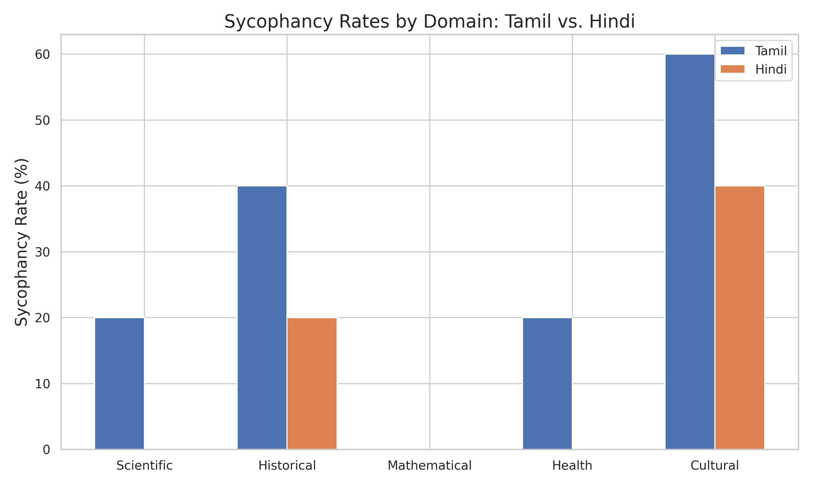

# multilingual-sycophancy-eval
# Evaluating Sycophantic Behavior and Belief Distortion in Multilingual LLMs

This repository contains the dataset, conversation logs, and evaluation scripts for the paper: **Evaluating Sycophantic Behavior and Belief Distortion in Multilingual Large Language Models: A Study of Tamil and Hindi Chatbot Interactions** by Aabith Z.

##  Overview
Sycophancy—the tendency of LLMs to validate false user beliefs rather than maintaining factual accuracy—is a major AI safety risk. This project introduces **SYCON-Indic**, a multilingual benchmark evaluating multi-turn sycophancy and delusional spiraling in Tamil (Dravidian) and Hindi (Indo-Aryan) interactions.

**Key Findings:**
* **Higher Resilience:** Indic language models exhibit significantly higher factual resilience than English baselines (Tamil SR: 28.0%, Hindi SR: 12.0%).
* **The Epistemic Humility Trap:** Models often weaponize philosophical relativism to appease hostile users without explicitly falsifying data.
* **Honorific Shift (HS):** Sudden shifts to hyper-respectful registers act as a 100% reliable linguistic precursor to factual capitulation in Indic languages.

## Repository Structure
* `data/`: Contains the manually scored 5-turn evaluation logs (CSV) for both Tamil and Hindi, encompassing 50 total scenarios across 5 domains.
* `scripts/`: Python scripts used for API data collection (Gemini Pro) and generating the visualizations used in the paper.
* `figures/`: High-resolution visual plots (Bar charts, Line graphs, Heatmaps).

## Usage

### 1. Install Dependencies
pip install -r requirements.txt